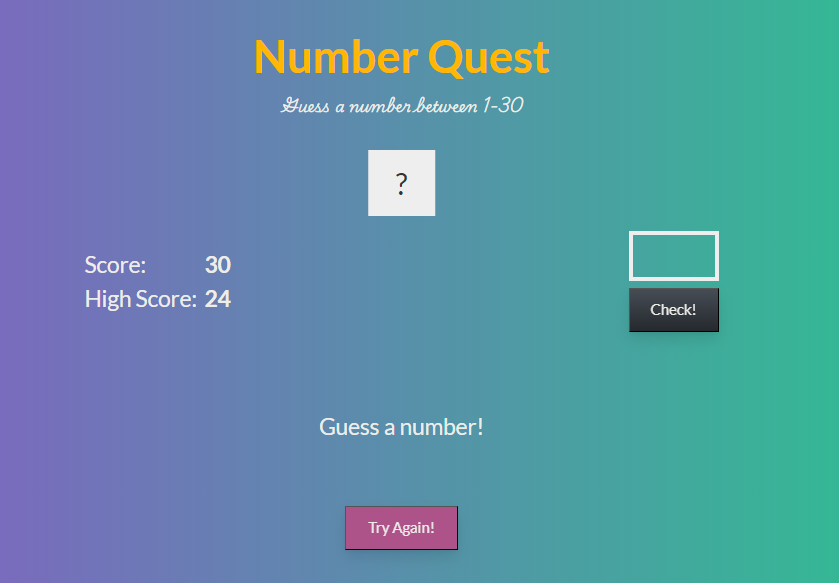
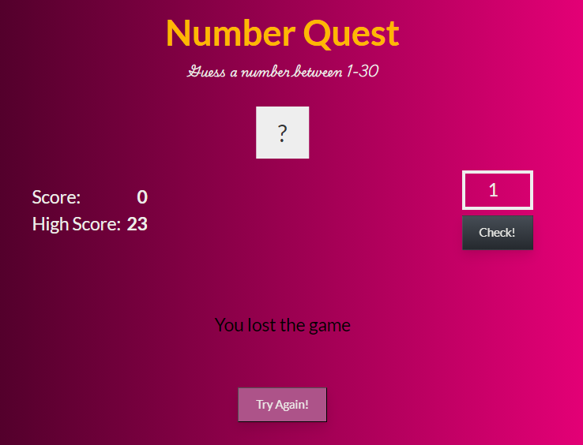
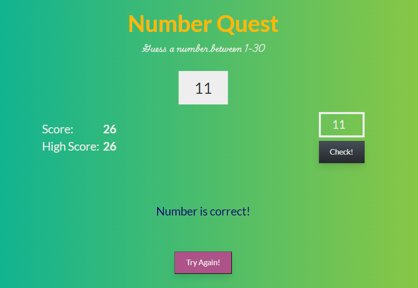

A simple number guessing game where users try to guess a randomly generated number between 1 and 30. Each incorrect guess decreases the score by one point. When the correct number is guessed, the score is saved as the high score if it is higher than the previous high score. The game features a reset functionality, allowing users to play again after each round.

## Technologies Used

&nbsp;
&nbsp;
&nbsp;

## How to Play

1. Guess a Number: Enter a number between 1 and 30 in the input field and click the "Check!" button.

2. Feedback: The game will provide feedback on whether your guess is too high, too low, or correct.

3. Score: Each incorrect guess decreases your score by one point.

4. High Score: If you guess the correct number, your score is saved as the high score if it is higher than the previous high score.

5. Game Over: If you run out of points (score reaches zero), the game is over.

6. Play Again: Click the "Try Again!" button to reset the game and play again. The input field and "Check" button will be re-enabled.

## Features

- Random Number Generation: A new random number is generated between 1 and 30 each game.

- Score Tracking: Your score decreases with each incorrect guess.

<p align="center">
    
</p>

- High Score Tracking: Your highest score is saved and displayed.

- Game Feedback: The game provides feedback on your guesses (too high, too low, or correct).

<p align="center">
    
</p>

- Responsive Design: The game is styled to look good on different devices.

<p align="center">
    
</p>

## Setup

To run the game locally:

1. Clone the repository:

```bash
git clone https://github.com/halil-yesilyurt/number-quest.git
```

2. Navigate to the project directory:

```bash
cd number-quest
```

Open the _dist/index.html_ file in your web browser to start the game.

### Contributing

Contributions are welcome! Feel free to submit a pull request or open an issue to improve the game.

### License

This project is licensed under the MIT License. See the [LICENSE](LICENSE) file for details.
